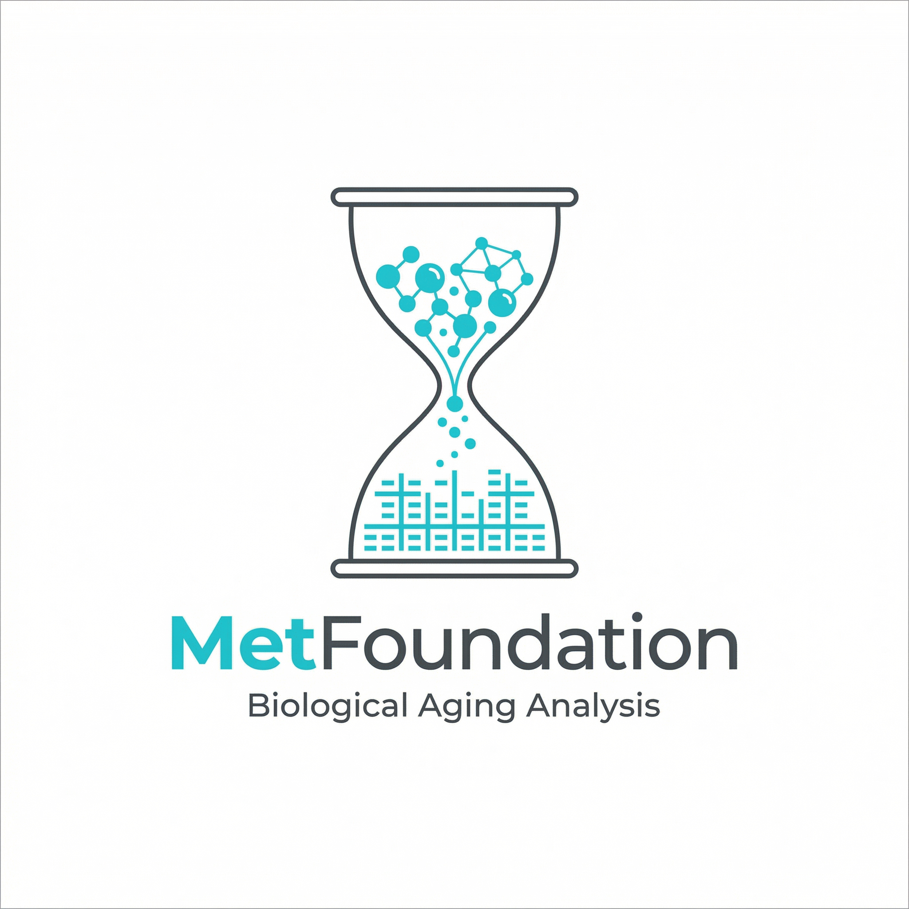

# MetFoundation: Decoding heterogeneous aging clocks and disease risk stratification using a metabolomic foundation model
[]([LICENSE_URL])
[](https://www.python.org/downloads/)
[](https://pytorch.org/)

> **[Paper Title]**  
> [Author Names]  
> [Conference/Journal Name, Year]  
> [[Paper]]([PAPER_URL]) | [[Supplementary]]([SUPP_URL]) | [[BibTeX]](#citation)

---

<p align="center">
  
</p>


## 📋 Overview

**MetFoundation** is a transformer-based foundation model for metabolomic data analysis. Pre-trained on large-scale blood metabolomics data using masked language modeling, MetFoundation learns robust representations of metabolic profiles that can be applied to diverse downstream tasks including:

- 🧬 **Embedding Extraction**: Generate 512-dimensional metabolomic embeddings for samples
- ⚕️ **Mortality Risk Prediction**: Fine-tuned model for survival analysis and risk assessment
- ⏳ **Biological Age Estimation**: Convert mortality risk to age acceleration metrics
- 🔬 **Metabolic Subtype Classification**: Identify metabolic phenotypes and disease associations
- 🚀 **Lightweight Deployment**: Distilled model for 300× faster inference

---

## ✨ Key Features

- **Foundation Model Architecture**: 6-layer transformer with 8 attention heads (~19.3M parameters)
- **Masked Language Modeling**: Pre-trained to predict masked metabolite concentrations
- **Transfer Learning**: Pre-trained embeddings improve performance on downstream tasks
- **Multi-task Capability**: Simultaneous prediction of multiple clinical outcomes
- **Model Distillation**: Lightweight 3-layer feedforward model (<1M parameters) for deployment

- **Flexible Data Format**: Built on AnnData for seamless integration with bioinformatics workflows

---

## 🛠️ Installation

### Requirements

- Python 3.12
- PyTorch 2.3.0
- CUDA (optional, for GPU acceleration)

### Setup Environment

```bash
# Clone the repository
git clone https://github.com/ericcombiolab/MetFoundation
cd MetFoundation

# Create conda environment from file
conda env create -f environment_cpu.yml
conda activate MetFoundation

# For GPU support, replace cpuonly with cudatoolkit in environment_cpu.yml
```

### Manual Installation

```bash
conda create -n MetFoundation python=3.12
conda activate MetFoundation

# Install PyTorch (CPU version)
conda install pytorch=2.3.0 cpuonly -c pytorch

# Install dependencies
conda install pandas anndata matplotlib seaborn scikit-learn -c conda-forge
pip install accelerate einops transformers shap timm
```

---

## 📊 Data Preparation

### Supported Datasets

The model is compatible with metabolomics data from:
- **UK Biobank (UKB)**: NMR metabolomics and blood metabolomics
- **CHARLS**: China Health and Retirement Longitudinal Study
- **Custom datasets**: Any metabolomics data in AnnData format

### Data Format

Input data should be in **AnnData (.h5ad)** format with:

```python
adata.X                    # Metabolite concentrations [n_samples × n_metabolites]
adata.obs                  # Sample metadata (age, sex, BMI, outcomes)
adata.var                  # Metabolite metadata (names, normalization params)
```

### Example Data

Fake datasets for testing are provided in `Data/`:
```
Data/
├── UKB_NMR/fake_val.h5ad          # Synthetic UK Biobank NMR data
├── UKB_Blood/fake_val.h5ad        # Synthetic UK Biobank blood data
└── CHARLS/fake_charls_2011_adata.h5ad  # Synthetic CHARLS data
```

To generate custom fake data, see [`Data/Fake_data_generation.ipynb`](Data/Fake_data_generation.ipynb).

---


## 🏗️ Model Architecture

### Full MetFoundation Model

```
MetFoundation (19.3M parameters)
│
├── Embedding Layer
│   ├── Metabolite Embeddings (learned or prior-based)
│   ├── Concentration Value Embeddings (lookup table)
│   └── Special Tokens (CLS, PAD, MASK)
│
├── Transformer Encoder (6 layers)
│   ├── Multi-Head Self-Attention (8 heads)
│   ├── Feed-Forward Network (2048 → 512)
│   └── Layer Normalization + Residual Connections
│
└── Task-Specific Heads
    ├── Embedding Extraction (CLS token)
    ├── Survival Prediction (age-fused risk head)
    ├── Concentration Prediction (pre-training objective)
    └── Metabolic Subtype Classification
```

### Lightweight Model

```
Lightweight MetFoundation (<1M parameters)
│
├── Input: Normalized Metabolite Concentrations
│
├── 3-Layer Feedforward Network
│   ├── Linear + BatchNorm + ReLU + Residual
│   ├── Linear + BatchNorm + ReLU + Residual
│   └── Linear + BatchNorm + ReLU + Residual
│
└── Output: 512-d Embeddings
```

**Model Configurations:**
- Hidden dimension: 512
- Attention heads: 8
- Transformer layers: 6
- Feed-forward dimension: 2048
- Dropout: 0.1

---
## 🚀 Quick Start
### 📓 Demo Notebooks

| Notebook | Description | Input | Output |
|----------|-------------|-------|--------|
| [1_embedding_extraction.ipynb](1_embedding_extraction.ipynb) | Extract metabolomic embeddings using pre-trained model | `.h5ad` metabolomics data | Embeddings (`.npy`, `.csv`) |
| [2_mortality_risk_age_acceleration.ipynb](2_mortality_risk_age_acceleration.ipynb) | Predict mortality risk and biological age | Embeddings or raw data | Risk scores, age acceleration |
| [3_metabolic_subtype.ipynb](3_metabolic_subtype.ipynb) | Classify samples into metabolic subtypes | Embeddings | Subtype predictions, distributions |
| [4_lighweight_usage.ipynb](4_lighweight_usage.ipynb) | End-to-end inference with lightweight model | Raw metabolite data | Embeddings, risks, subtypes |

**Example outputs** are provided in `Demo_output/` directory.

---

## 🧪 Training & Evaluation
**! The source code for this part is still sorting；coming soon**
### Pre-training

Pre-train MetFoundation on metabolomics data using masked language modeling:

```bash
python Src/pretrain_UKBNMR.py \
    --config Src/pretrain_config_NMR/mlmtask.json \
    --data_path Data/UKB_NMR/train.h5ad \
    --output_dir Model_Weights/MetFoundation \
    --epochs 100 \
    --batch_size 256 \
    --learning_rate 1e-4
```

**Pre-training objectives:**
- Masked metabolite concentration prediction (MAE loss)

### Fine-tuning for Survival Analysis

Fine-tune pre-trained model for mortality prediction:

```bash
python Src/finetune_UKBNMR_Mortality.py \
    --pretrained_model Model_Weights/MetFoundation/model_weights.pth \
    --data_path Data/UKB_NMR/train.h5ad \
    --output_dir Model_Weights/SurvivalModule \
    --epochs 50 \
    --batch_size 128
```

**Loss function:** Cox proportional hazards loss with age embedding fusion

### Model Distillation

Train lightweight model by distilling from pre-trained MetFoundation:

```bash
python Src/distill_lightweight.py \
    --config Src/distill_config/blood_Distill.json \
    --teacher_model Model_Weights/MetFoundation/model_weights.pth \
    --data_path Data/UKB_Blood/train.h5ad \
    --output_dir Model_Weights/Lightweight
```

### Evaluation

Evaluate fine-tuned models on validation sets:

```bash
# Survival prediction
python Src/eval_Mortality_UKB.py \
    --model_path Model_Weights/SurvivalModule/model_weights.pth \
    --data_path Data/UKB_NMR/val.h5ad

# Distilled model
python Src/eval_Distilled_UKB.py \
    --model_path Model_Weights/Lightweight/model_weights.pth \
    --data_path Data/UKB_Blood/val.h5ad
```

---

## 📁 Project Structure

```
MetFoundation/
│
├── 1_embedding_extraction.ipynb           # Demo: Extract embeddings
├── 2_mortality_risk_age_acceleration.ipynb # Demo: Survival analysis
├── 3_metabolic_subtype.ipynb              # Demo: Subtype classification
├── 4_lighweight_usage.ipynb               # Demo: Lightweight model
│
├── Data/                                   # Datasets
│   ├── UKB_NMR/                           # UK Biobank NMR metabolomics
│   ├── UKB_Blood/                         # UK Biobank blood metabolomics
│   ├── CHARLS/                            # CHARLS cohort data
│   └── Fake_data_generation.ipynb         # Generate synthetic data
│
├── Model_Weights/                          # Pre-trained model weights
│   ├── MetFoundation/                     # Full transformer model
│   │   ├── model_weights.pth
│   │   └── config.json
│   ├── SurvivalModule/                    # Fine-tuned survival head
│   │   └── model_weights.pth
│   └── Lightweight/                       # Distilled lightweight model
│       └── model_weights.pth
│
├── Defined_Tools/                          # Pre-trained classifiers
│   ├── subtype_classifier.joblib          # Metabolic subtype classifier
│   └── Risk2AgeAccel_model.joblib         # Risk-to-age conversion model
│
├── Src/                                    # Source code
│   ├── metfoundation_torch/               # Core model implementation
│   │   ├── models.py                      # Model architectures
│   │   ├── tokenizer.py                   # Metabolite tokenizer
│   │   ├── dataset.py                     # Data loading & preprocessing
│   │   └── mask_utils.py                  # Masking strategies
│   │
│   ├── pretrain_UKBNMR.py                 # Pre-training script
│   ├── finetune_UKBNMR_Mortality.py       # Fine-tuning for survival
│   ├── distill_lightweight.py             # Model distillation
│   ├── eval_Mortality_UKB.py              # Evaluate survival model
│   ├── eval_Distilled_UKB.py              # Evaluate distilled model
│   ├── eval_NMR_UKB.py                    # Evaluate on NMR data
│   ├── eval_UKBNMR_distilled.py           # Cross-evaluate distilled model
│   └── utils.py                           # Utility functions
│
├── Demo_output/                            # Example outputs
│   ├── val_embeddings.npy                 # Sample embeddings
│   ├── metabolic_subtype_predictions.csv  # Subtype predictions
│   └── charls_2011_comprehensive_results_lightweight.csv
│
├── environment_cpu.yml                     # Conda environment (CPU)
└── readme.md                               # This file
```

---


## 💡 Use Cases

### Research Applications
- Biomarker discovery for disease prediction
- Metabolic aging and longevity studies
- Population health screening and risk stratification
- Multi-omics integration and systems biology

### Clinical Applications
- Routine health assessment from blood tests
- Early disease detection and prevention
- Personalized nutrition and lifestyle recommendations
- Treatment monitoring and efficacy evaluation

---


## 📚 Citation

If you use MetFoundation in your research, please cite:

```bibtex
@article{[CITATION_KEY],
  title={[Paper Title]},
  author={[Author Names]},
  journal={[Journal Name]},
  year={[Year]},
  volume={[Volume]},
  pages={[Pages]},
  doi={[DOI]}
}
```

---

## 📄 License

This project is licensed under [LICENSE_TYPE] - see the [LICENSE](LICENSE) file for details.

---

## 🔗 Related Resources

<!-- - **scFoundation**: Foundation model for single-cell genomics [[Paper]](https://www.nature.com/articles/s41592-024-02305-7) -->
- **UK Biobank**: Large-scale biomedical database [[Website]](https://www.ukbiobank.ac.uk/)
- **CHARLS**: China Health and Retirement Longitudinal Study [[Website]](http://charls.pku.edu.cn/en)

---

## 📧 Contact

For questions and feedback:

- **Primary Contact**: Yu Xu (email: csyuxu@comp.hkbu.edu.hk)
- **Project Website**: [Website URL]
- **Issues**: Please use [GitHub Issues]([ISSUES_URL]) for bug reports and feature requests

---

<!-- ## 🙏 Acknowledgments

- [Funding Source 1]: [Grant Number]
- [Funding Source 2]: [Grant Number]
- UK Biobank participants and research team
- CHARLS research team and participants
- [Additional Acknowledgments]

--- -->

**Last Updated**: [12/March/2026]  
**Version**: [pre-version]